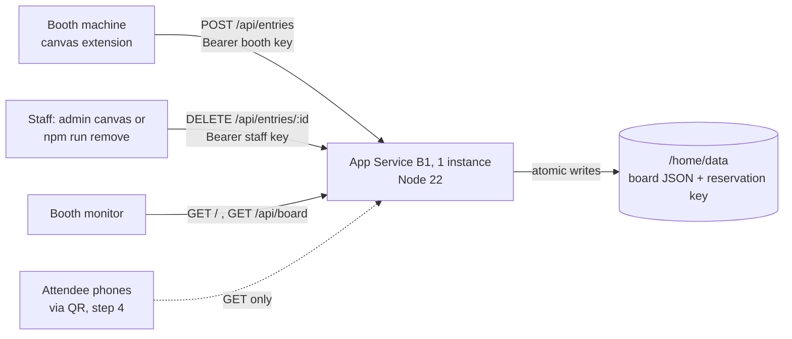

# Azure Deployment Plan: Commit & Sip event leaderboard

> **Status:** Deployed

Generated: 2026-09-29T21:50Z

---

## 1. Project Overview

**Goal:** Host a read-only public leaderboard for the Commit & Sip booth. It is shown on the booth monitor and reached by attendees' phones through the booth QR code. Booth machines submit scored drinks to it, and staff can take a drink down from it.

**Path:** Add Components (a new service in an existing repository; the booth canvas extension is unchanged apart from its client wiring)

**Scope:** Steps 1-3 only.

| # | Step | In scope |
|---|---|---|
| 1 | Leaderboard service in-repo, plus contract tests | Yes |
| 2 | Provision in Azure | Yes |
| 3 | Wire the booth client (`publish`) and staff takedown (`npm run remove`) to the service | Yes |
| 4 | Point the public QR at it and run a live event | **No.** Gated on the blocklist review (`booth/blocked-terms.json` is still `placeholder: true`) and on brand sign-off for `mona.png`. |

Until step 4, the service is exercised only with staff test entries. No attendee-submitted name is published.

---

## 2. Requirements

| Attribute | Value |
|-----------|-------|
| Classification | Production-shaped event service, in a NonProd subscription |
| Scale | Small: a few hundred entries per event, one to a few booth machines, one monitor polling, some phones |
| Budget | Cost-optimized |
| **Subscription** | GitHub - NonProd - skills (`6aab8b26-48c5-4cfd-ac82-6b5efcc2e441`). Confirmed by the user. |
| **Location** | `westus3` confirmed by the user; **deployed to `westus2`** after West US 3 had no B1 capacity (user-approved fallback, see §8a). |

**Note:** the Azure CLI default subscription on this machine is a different subscription (`GH-Actions-Runner Runners`). Every command must pass `--subscription` explicitly.

**Note:** the subscription is named NonProd, but a QR code at a live event is production traffic. Before step 4, confirm that no auto-shutdown, cleanup schedule, or ingress policy applies to it.

### Subscription policy findings (measured, not assumed)

| Rule | Effect | Plan response |
|---|---|---|
| Allowed locations (mg-github) | deny | `westus3` is permitted |
| Storage: HTTPS only, no anonymous blob access, no classic accounts | deny | **Not applicable.** No storage account is deployed. |
| **GH.15.05 — storage must disable shared-key access** | audit | **Not applicable.** This rule is why Static Web Apps managed Functions were rejected. |
| **GH.15.08 — tag `data_classification`** | audit | Applies only to storage accounts. Every resource is tagged `public` anyway. See §5. |
| Storage firewall / network isolation (SFI) | audit | **Not applicable.** No storage account is deployed. |

Three tenant-root assignments cannot be read with the deployer's permissions. Their effects were read from policy compliance states instead. All of their storage rules are audit-only. **No policy assessment of `Microsoft.Web` resources was possible in advance.** `what-if` during validation is the check.

---

## 3. Components Detected

| Component | Type | Technology | Path |
|-----------|------|------------|------|
| Booth canvas extension (existing) | Client | Node 22 ESM, Copilot canvas SDK | `.github/extensions/commit-and-sip/` |
| Leaderboard client seam (existing) | Contract | `submissionFor`, `validateReceipt`, `validateLeaderboardClient` | `.github/extensions/commit-and-sip/services/leaderboard.mjs` |
| Rubric, name rules, moderation, ranking (existing) | Shared domain | Pure Node ESM that imports only `node:` built-ins | `.github/extensions/commit-and-sip/services/{name-score,coffee-name,moderation,booth-menu}.mjs` |
| **Leaderboard service (new)** | API + static board page | Node 22, `node:http`, `@azure/data-tables`, `@azure/identity` | `leaderboard-service/` |
| Staff takedown (existing) | CLI | Node | `scripts/remove-drink.mjs` |

Specialized-technology check: the canvas extension imports `@github/copilot-sdk/extension`, but **the deployed component does not**. The leaderboard service is a plain Node HTTP app, so `azure-hosted-copilot-sdk` routing does not apply to what is being hosted.

---

## 4. Recipe Selection

**Selected:** Bicep, deployed with the Azure CLI (`az deployment group create`)

**Rationale:** `azd` is not installed, and there is one service. `az` and Bicep are already present. Adding `azd` would add a tool to the staff machine for no capability this deployment needs. The Azure Functions `azd init -t` template rule does not apply, because no Function App is used.

---

## 5. Architecture

> **Revised during execution, with user approval.** The approved plan used Table Storage through a managed identity. Writing the role assignment needs `Microsoft.Authorization/roleAssignments/write`, and the deployer holds **Contributor**, with no eligible PIM elevation. The only subscription Owner is an unnamed principal. The user chose to drop the storage account and keep the board on App Service's persistent `/home` storage. A second decision, also the user's, reserves removed names with a keyed fingerprint.

**Stack:** App Service (Linux, code deployment, Node built-ins only, no container, no SDK)

### Service Mapping

| Component | Azure Service | SKU |
|-----------|---------------|-----|
| Leaderboard API + board page | App Service (Linux, Node 22 LTS), Always On, **capacity 1** | **B1** |
| Leaderboard data | App Service persistent `/home` storage (part of the app) | — |

No storage account, role assignment, or key vault. Nothing needs `roleAssignments/write`. The app has a system-assigned identity with **no roles**, added for the App Fundamentals audit (see §8).

### Why this shape

- **Static Web Apps managed Functions cannot use managed identity**, so they would need a storage key, which breaches GH.15.05. Static Web Apps is also not offered in `westus3`.
- **Table Storage through a managed identity needs a role grant** that the deployer cannot make.
- **The Free tier (F1)** has no Always On and a 60 CPU-minute daily quota. A monitor polling all day could stop the board mid-event.
- `/home` survives restarts and redeploys. It is safe only with one writer, so capacity is pinned to 1, overlapped recycling is disabled, and writes are serialised and atomic (temp file plus rename). If the file is unreadable, the service refuses to start rather than overwrite it.
- **The board is a projection.** Every booth keeps the authoritative copy, and `npm run leaderboard:republish` rebuilds the board from each booth.

### API

| Route | Auth | Behaviour |
|---|---|---|
| `GET /` | public | Board page. Shows "Updated HH:MM:SS"; if it goes offline it keeps the last board and says it is stale. No mascot art. |
| `GET /api/board[?handle=]` | public | Top 20, true total, `asOf`, and the attendee's own place |
| `POST /api/entries` | booth key | Re-scored and re-moderated with the booth's own modules. Receipt echoes `handle, id, name, score` |
| `DELETE /api/entries/:id` | staff key | Deletes and **reserves the ID** as an HMAC fingerprint. 404 still reserves |
| `GET /healthz` | public | `{ ok, moderation }` |

### Security decisions

1. **Re-validation with the booth's own code**: name rules, blocklist, house-example exclusion, score, ID, curated handle words, and the booth's `leaderboard()` ranking. A leaked booth key cannot post a fake score, a blocked name, or free-text handles.
2. **Separate booth and staff keys** (at least 32 characters, must differ, constant-time comparison). They are `@secure()` Bicep parameters supplied from `booth/local-config.json`, so a redeploy cannot wipe hand-set settings and the keys never enter the repository.
3. **Reservations keep no readable trace.** The HMAC key is generated by the service, stored beside the board with mode 0600, and not derived from the staff key, so rotating the staff key cannot void reservations. The stored board holds no removed name, reason, or remover.
4. **No personal data.** Everything stored is either shown on the public board or unreadable without the service's key, so `data_classification: public` is accurate.
5. The web app is HTTPS-only with TLS 1.2 minimum. FTP and basic-auth publishing credentials are disabled, and deployment authenticates with Entra ID.
6. **The client uses DNS-pinned `publicFetch`**, so a hostile DNS record cannot redirect booth traffic to the local network.

### Accepted limitations

- One shared booth key: a compromised booth cannot be revoked alone.
- The page needs JavaScript.
- Retention windows for old event boards are undecided.
- Rubric or blocklist changes need a service redeploy in step with the booths.

---

## 6. Provisioning Limit Checklist

### Phase 1: Resource Inventory

| Resource Type | Number to Deploy | Total After Deployment | Limit/Quota | Notes |
|---------------|------------------|------------------------|-------------|-------|
| Microsoft.Resources/resourceGroups | 1 | 4 | 980 per subscription | Fetched from: `az group list` (3 existing) + official docs |
| Microsoft.Web/serverFarms (B1 Linux) | 1 | 1 | 100 per resource group (Basic) | Fetched from: `az resource list` (0 existing) + official docs (`azure-websites-limits.md`). B1 Linux availability in West US 3 confirmed via `az appservice list-locations`. |
| Microsoft.Web/sites | 1 | 1 | Unlimited per Basic plan | Fetched from: `az resource list` (0 existing) + official docs |

The storage account in the original inventory was removed together with Table Storage.

**Quota API:** `az quota` returned `MissingRegistrationForResourceProvider` because `Microsoft.Quota` is not registered. Registering a provider is a subscription-wide change to a shared subscription, so it was not made for a planning check. The documented fallback was used instead. `Microsoft.Web` is registered.

**Name availability:** `commit-and-sip-leaderboard` was confirmed available via `Microsoft.Web/checknameavailability`.

**Status:** ✅ All resources within limits

---

## 7. Execution Checklist

### Phase 1: Planning
- [x] Analyze workspace
- [x] Gather requirements
- [x] Confirm subscription and location with user
- [x] Prepare resource inventory
- [x] Fetch quotas and validate capacity (fallback: resource counts + official docs; quota provider not registered)
- [x] Scan codebase
- [x] Select recipe
- [x] Plan architecture
- [x] **User approved this plan**

### Phase 2: Execution
- [x] Step 1: `leaderboard-service/` (app, file store, board page), Node built-ins only
- [x] Step 1: contract tests run the service's **real** responses through the extension's `validateReceipt`, and an end-to-end test drives a real `BoothEngine` against a real server
- [x] Step 1: auth, re-validation, tie ranking, idempotency, reservations, atomic persistence, packaging and config tests. **Guards mutation-tested: 53 mutations, all real ones caught.** One equivalent mutant is documented.
- [x] Step 2: `infra/main.bicep` + `infra/modules/app.bicep` (resource group, plan, site, credential policies, logs). `az bicep build` is clean.
- [x] Step 2: `scripts/package-leaderboard.mjs`: derives files from the import graph, never packages `booth/local-config.json`, and smoke-tests the staged copy
- [x] Step 3: HTTP client (`services/leaderboard-client.mjs`) built from `leaderboardApi`; `leaderboardUrl` (QR) deliberately left separate
- [x] Step 3: takedown retracts from the public board (admin canvas and `npm run remove`), with failure recording, retry, and handling for the in-flight race
- [x] Step 3: `npm run leaderboard:configure` / `:package` / `:republish`
- [x] Receipt `id` checked on both sides, as `docs/leaderboard-service.md` required
- [x] Docs: README, RUNBOOK, integration contract, architecture, leaderboard service design
- [x] Update plan status to "Ready for Validation"

### Phase 3: Validation
- [x] **PREREQUISITE:** Plan status is "Ready for Validation"
- [x] Invoke azure-validate skill
- [x] All validation checks pass
  - [x] 1. Bicep compilation
  - [x] 2. Template validation (`az deployment sub validate`, which includes preflight deny-policy evaluation)
  - [x] 3. What-if preview: 6 creates, 0 modifies, 0 deletes
  - [x] 4. Authentication
  - [x] 5. Linting
  - [x] 6. Azure Policy validation
  - [x] Build verification: `npm test`, `npm run check`, `npm run leaderboard:package` (staged smoke test)
  - [x] Static role verification
- [x] Update plan status to "Validated"
- [x] Record validation proof below

### Phase 4: Deployment
- [x] Invoke azure-deploy skill
- [x] Deployment successful, **in `westus2`, not the planned `westus3`** (see §8a)
- [x] Report deployed endpoint URLs
- [x] Update plan status to "Deployed"

---

## 8. Validation Proof

Secure parameters were supplied as **throwaway random values** from a 0600 temporary file, which was deleted afterwards. Real keys are generated during deployment.

| Check | Command Run | Result | Timestamp |
|-------|-------------|--------|-----------|
| Bicep compiles | `az bicep build --file infra/main.bicep` | ✅ Pass, no warnings | 2026-09-30T13:03Z |
| Lint | `az bicep lint --file infra/main.bicep` | ✅ Pass, no findings | 2026-09-30T13:03Z |
| Auth | `az account show --subscription 6aab8b26-…` | ✅ GitHub - NonProd - skills, arilivigni@githubazure.com | 2026-09-30T13:03Z |
| Template valid | `az deployment sub validate --location westus3 --template-file infra/main.bicep --parameters infra/main.parameters.json --parameters @<temp>` | ✅ Succeeded | 2026-09-30T13:03Z |
| What-if | `az deployment sub what-if …` (same inputs) | ✅ Succeeded: 6 creates (RG, plan, site, 2 credential policies, logs config), 0 modify, 0 delete | 2026-09-30T13:03Z |
| Policy | Azure MCP `policy_assignment_list` + `az rest` on the `app_fundamentals_assign` parameters | ✅ No deny rule applies to `Microsoft.Web`. Allowed-locations (deny) permits `westus3`. | 2026-09-30T12:58Z |
| Build | `npm test` / `npm run check` / `npm run leaderboard:package` | ✅ 160 pass, 0 fail; syntax clean; staged copy served every page | 2026-09-30T13:03Z |

### Policy findings for `Microsoft.Web` ("App Fundamental Policies", all Audit)

| Rule | Status |
|---|---|
| FTP and local auth disabled; SCM local auth disabled | ✅ Compliant |
| HTTPS only; TLS 1.2; HTTP/2; remote debugging off | ✅ Compliant |
| Managed identity | ✅ Compliant. A system-assigned identity with **no role assignments**, added after this finding. |
| **Client certificates** | ⚠️ **Accepted, non-compliant by design.** The board is public and read by phones that hold no client certificate. |
| End-to-end TLS (`auditEndToEndTlsAppservice`) | ⚠️ Accepted. The public edge terminates TLS; there is no private back end. |

The tenant-root **MFA enforcement for resource write actions** cannot be evaluated by validation. The real deployment will fail if the CLI token lacks an MFA claim; if it does, re-authenticate with `az login` and retry.

### Role Assignment Verification
- **Status:** Verified
- **Identities checked:** the system-assigned identity of `commit-and-sip-leaderboard`
- **Roles confirmed:** none, which is correct. The service makes no Azure data-plane calls; it reads and writes only its own `/home` filesystem. The Bicep contains no `Microsoft.Authorization/roleAssignments`.
- **Issues:** none. The deployer holds Contributor, which is sufficient because no role assignment is created.

**Validated by:** azure-validate skill
**Validation timestamp:** 2026-09-30T13:03Z

---

## 8a. Deployment Record

| Time (UTC) | Action | Result |
|---|---|---|
| 2026-09-30 | `leaderboard:configure` | Keys generated into `booth/local-config.json` (0600, git-ignored) |
| 2026-09-30 | `az deployment sub create`, westus3, `rg-commit-and-sip-leaderboard` | ❌ `Conflict`: "No available instances", **regional B1 capacity** |
| 2026-09-30 | Same, retried | ❌ Same |
| 2026-09-30 | New RG `rg-commit-and-sip-lb-westus3` (Azure's suggested mitigation) | ❌ Same. The shortage is region-wide. |
| 2026-09-30 | westus2, `rg-commit-and-sip-lb-westus2` (user-approved fallback) | ✅ Succeeded |
| 2026-09-30 | Secure parameters file deleted | ✅ |
| 2026-09-30 | `az webapp deploy` (zip) | ✅ Content live. The CLI hung polling a status record the app never writes; `--async true` is now the documented command. |
| 2026-09-30 | Live verification found **HEAD / returned 404** | ❌ This would have blocked `npm run qr` (it checks the destination with HEAD). Fixed, tested, mutation-checked, redeployed. ✅ |

**Lesson recorded:** the provisioning check in §6 confirmed quota and SKU listing. Neither detects physical capacity, which only the deployment itself revealed.

**Left behind:** two **empty** resource groups in westus3 (`rg-commit-and-sip-leaderboard`, `rg-commit-and-sip-lb-westus3`). They contain nothing and cost nothing, and are kept until the user approves deleting them.

### Functional verification (live)

| Check | Result |
|---|---|
| Real `BoothEngine`, production client (DNS-pinned `publicFetch`), staff test drink | ✅ `confirmed`, rank 1 of 1 |
| Drink visible on the public board | ✅ |
| Takedown through the engine | ✅ `retracted` |
| Gone from the public board | ✅ |
| Same name from another handle | ✅ `409 unavailable_drink` |
| Reservation survives a redeploy **and** an explicit restart (proves `/home` persistence and the reservation key) | ✅ |
| POST without key / DELETE with booth key | ✅ 401 / 401 |
| Forged score with a valid key | ✅ `422 score_mismatch` |
| Plain HTTP | ✅ 301 to HTTPS |
| `HEAD /` with CSP header | ✅ 200 (after fix) |
| `/booth/local-config.json` | ✅ 404 |
| `/healthz` | ✅ `{"moderation":"placeholder","ok":true}` |
| Platform: HTTPS-only, client certs off, Always On, FTPS disabled, TLS 1.2, HTTP/2, remote debugging off, Node 22, B1 × 1, SCM/FTP basic auth disabled | ✅ All as coded |
| What-if with the committed parameters | ✅ 0 creates, 0 deletes. The `Modify` rows are App Service `siteConfig` noise; each flagged property was read live and matches. |

**Test residue:** the reserved fingerprint of "Mona Staff Test Brew" on the `default` board. The board itself is empty.

### Live Role Verification
- The app's system-assigned identity holds **0** role assignments (`az role assignment list --assignee <principal> --all`). That is correct: the code makes no Azure data-plane calls.

**Endpoint:** <https://commit-and-sip-leaderboard.azurewebsites.net>

---

## 9. Files to Generate

| File | Purpose | Status |
|------|---------|--------|
| `.azure/deployment-plan.md` | This plan | ✅ |
| `leaderboard-service/{app,store,server}.mjs` | HTTP API, file store with reservations, entry point | ✅ |
| `leaderboard-service/public/` | Board page (Mona Sans, primary palette, light theme, no mascot art) | ✅ |
| `infra/main.bicep`, `infra/modules/app.bicep`, `infra/main.parameters.json` | Infrastructure (no secrets committed) | ✅ |
| `.github/extensions/commit-and-sip/services/leaderboard-client.mjs` | Booth HTTP client | ✅ |
| `scripts/{configure,package,republish}-leaderboard.mjs` | Staff operations | ✅ |
| `tests/leaderboard-service.test.mjs` | Contract, security, persistence, packaging, infra tests | ✅ |

## 10. Next Steps

> Current: Deployed. Step 4 (public QR) remains gated on the blocklist review and brand sign-off.

1. azure-validate: `az bicep build`, `what-if`, packaging smoke test
2. azure-deploy: `leaderboard:configure` → `az deployment sub create` → `leaderboard:package` → `az webapp deploy`
3. Functional verification against the live endpoint with a staff test entry
